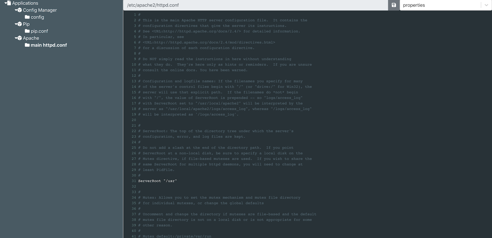

# Server Config Manager
> A streamlined web interface to manage config files on a remote server

[![NPM Version][npm-image]][npm-url]



## Installation

```sh
yarn global add server-config-manager
```

## Usage
```sh
server-config-manager [configLocation]

start the server

Positionals:
  configLocation  Location of config file
                          [default: "~/.config/config-manager.ini"]

Options:
  --help         Show help                                             [boolean]
  --version      Show version number                                   [boolean]
  --verbose, -v                                                 [default: false]
  --port, -p                                                     [default: 5000]
```

## Sample `config-manager.ini`

Username and password will be used for basic authentication for the web interface

The `[Config Manager]` section is mandatory and will be auto generated the first time you provide your config file to the application

```ini
username = admin
password = admin

[Config Manager]
config = /Users/username/.config/config-manager.ini

[Pip]
pip.conf = /Users/username/.config/pip/pip.conf

[Apache]
main httpd.conf = /etc/apache2/httpd.conf
```


## Development setup

```sh
yarn
```

### To start the development server:

```sh
yarn build
```

Then:

```sh
yarn start
```

### To start a react development server for the frontend:

Start the development server as above then:

```sh
yarn watch:client
```

Access the react development server on port 3000

## Contributing

1. Fork it (<https://github.com/bentekkie/config-manager>)
2. Create your feature branch (`git checkout -b feature/fooBar`)
3. Commit your changes (`git commit -am 'Add some fooBar'`)
4. Push to the branch (`git push origin feature/fooBar`)
5. Create a new Pull Request

<!-- Markdown link & img dfn's -->
[npm-image]: https://badge.fury.io/js/server-config-manager.svg?kill_cache=1
[npm-url]: https://www.npmjs.com/package/server-config-manager/v/latest
[npm-downloads]: https://img.shields.io/npm/dm/datadog-metrics.svg?style=flat-square
[travis-image]: https://img.shields.io/travis/dbader/node-datadog-metrics/master.svg?style=flat-square
[travis-url]: https://travis-ci.org/dbader/node-datadog-metrics
[wiki]: https://github.com/yourname/yourproject/wiki


